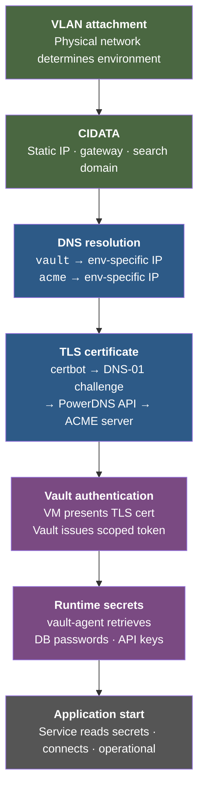
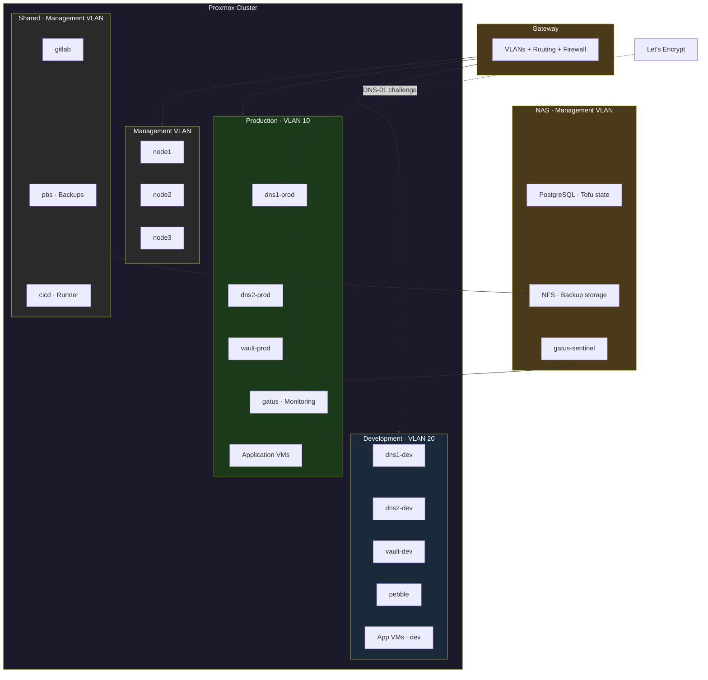
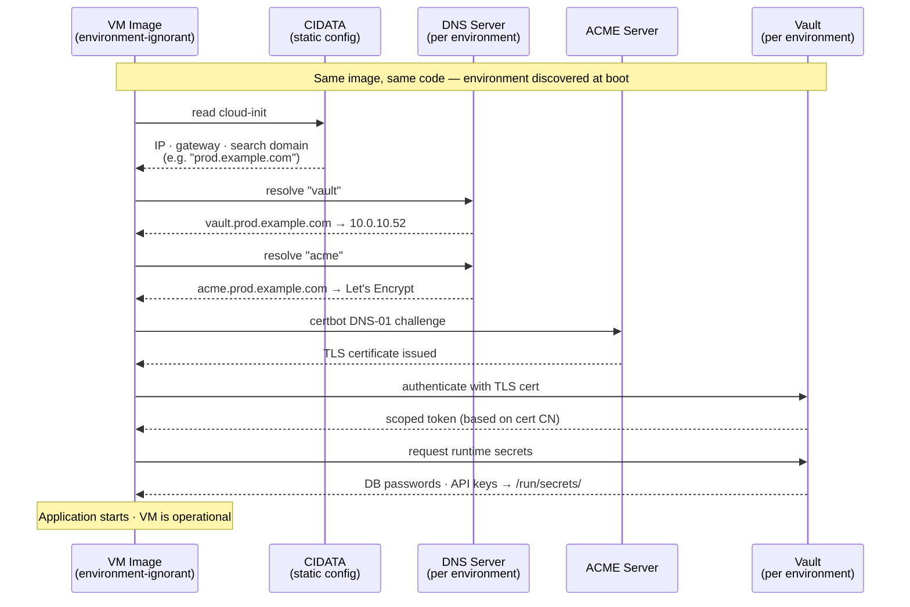
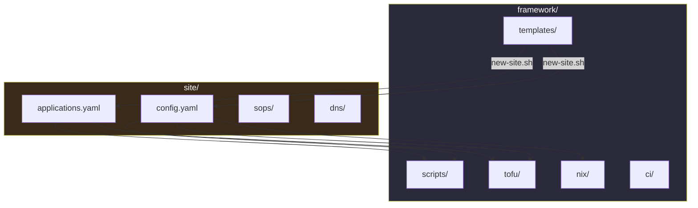

# Mycofu

*Grow your cluster from a single spore.*

A GitOps framework for Proxmox HA clusters with real dev/prod separation.

---

**Mycofu** is an infrastructure framework that gives you a real dev/prod
workflow on a bare-metal Proxmox cluster — with automated DNS, TLS
certificates, secrets management, and deterministic one-command rebuild.

Your infrastructure is not a lab. People depend on the services you run —
your family, your team, your clients. They deserve the same engineering rigor
as production software: a development environment where you test changes safely
before they touch anything real, and the confidence that if something breaks,
you can rebuild everything from some configs in YAML and a single key.

Mycofu manages the complexity required to make this possible — DNS, TLS,
secrets, immutable VM images, environment isolation — so that your interface is
some configs in YAML and a rebuild script. The individual tools exist. The
integration — wiring them into a framework you can clone, configure, and
run — is what Mycofu provides.

---

## Why This Exists

Most self-hosted infrastructure is a single environment. Services,
experiments, and untested changes all share the same network, the same DNS,
the same cluster. A bad configuration change to DNS takes down every service
that depends on name resolution. A Vault policy edit intended for one
application affects every application that authenticates. There's no way to
validate an infrastructure change without applying it to the infrastructure
people are using.

In professional software engineering, this is a solved problem: you maintain
a development environment where changes are validated before they reach
production. But in the self-hosted world, almost nobody does this for
infrastructure — not because they don't know better, but because building
a proper dev/prod boundary for bare-metal infrastructure is a substantial
integration project. It requires per-environment DNS, per-environment
secrets management, a certificate workflow that works identically in both
environments, and VM images that are environment-agnostic by construction.

Mycofu is that integration project, completed and packaged as a framework.
Your production environment runs the services people depend on. Your
development environment exercises the same code, the same images, and the
same toolchain — on a separate network with separate infrastructure. The
difference between dev and prod is which VLAN a VM boots on. Everything
else is identical.

This is a stronger guarantee than many professional release processes
achieve. There are no per-environment image builds, no environment
branches in configuration logic, no conditional paths that execute in prod
but not in dev. The VM image that boots in dev is bit-for-bit the same
image that boots in prod. The only difference is data: which static IP
the VM receives via CIDATA, which DNS responses come back, which Vault
instance the VM authenticates to. If your change works in dev, it works in prod —
because there is nothing different about prod except the data it operates
on.

Mycofu also eliminates the gap between software and configuration. In most
systems, software is versioned in git but configuration lives somewhere
else — config management databases, environment variables, files edited on
servers, Ansible runs applied out-of-band. When something breaks, you have
to reconstruct which version of the software was running with which
configuration. In Mycofu, configuration is committed to the same repo as
the framework code. A config change is a git commit. It triggers the same
CI/CD pipeline as a code change, builds the same kind of immutable image,
and is tested in dev before reaching prod. The git commit that built an
image fully determines both the software and its configuration. There is no
separate configuration state to track, no "it worked but the config was
different" ambiguity. When you test a commit, you are testing everything.

Proxmox HA on local storage is powerful but operationally demanding.
Cloud-init metadata is stored per-node — if a node fails, the surviving
nodes can't start its VMs without that metadata. ZFS replication leaves
orphaned data every time a VM is recreated, silently breaking replication
jobs until someone cleans them up. Post-deployment secrets fed back into
VM creation parameters cause infinite recreation loops. Corosync dual-link
networking requires manual configuration that Proxmox doesn't manage.
None of this is obvious from the documentation, and discovering it
through production failures is how most operators learn.

Mycofu makes Proxmox HA practical for a single operator by encoding all
of this surprising maintenance into automation. Without it, Proxmox HA on
local storage is practical only for operators who enjoy spending their
weekends debugging ZFS replication and corosync links. With Mycofu, the
operator's interface is some configs in YAML and a handful of scripts. The
complexity doesn't disappear — it moves into code that's tested once and
runs reliably thereafter.

You provide YAML files describing your hardware, network, domain, and
applications. The framework handles DNS, TLS certificates, secrets, VM
images, and orchestration. Some configs in YAML. One key. One command to
rebuild from scratch.

---

## Who Is This For

**Mycofu is for you if:**

- You run services that you or others depend on — not just experiments
- You want to test infrastructure changes before they affect production
- You're comfortable with the idea that a config file and a script replace
  manual setup, even if you don't understand every component on day one
- You have (or are willing to assemble) a multi-node Proxmox cluster,
  a VLAN-capable network, and an off-cluster NAS

**Mycofu is a good fit for:** private infrastructure for a consultancy or
research group, small-org IT with a handful of services, content creators
or educators who need a realistic and rebuildable infrastructure
environment, and home infrastructure that serves a family.

**Mycofu is not for you if:** you want a single-node setup with no
redundancy, you prefer GUI-driven configuration, you need multi-region or
multi-site infrastructure, or you need more than two environments (e.g.,
staging, QA, canary) with independent deployment pipelines.

---

## What's Inside

The dev/prod boundary requires a specific set of components working together.
Each one is here because removing it would break the boundary or force manual
intervention:

**Environment isolation (VLANs + static addressing)** — Each environment gets
its own network. VMs discover which environment they're in via the CIDATA
search domain delivered at creation time. No environment-specific configuration
is baked into images.

**DNS (PowerDNS)** — Separate DNS servers per environment make the search-domain
trick work. The same unqualified hostname (`vault`, `dns1`) resolves to
different IPs depending on the environment. The HTTP API enables automated
certificate challenges.

**TLS certificates (ACME + Pebble)** — Production uses Let's Encrypt. Dev uses
Pebble (a test ACME server). The certificate workflow is identical in both
environments — same certbot config, same DNS-01 challenge flow — because the
`acme` hostname resolves differently per environment. This is what allows VM
images to be fully environment-agnostic.

**Secrets (SOPS for bootstrap, Vault for runtime)** — SOPS encrypts the secrets
needed before Vault is available (the chicken-and-egg problem). Vault manages
everything after: per-service credentials, fine-grained access policies,
environment isolation by construction (dev VMs authenticate to a dev Vault
instance, prod to prod). The framework handles Vault deployment, initialization,
unsealing, and policy configuration.

**Immutable VM images (NixOS)** — Infrastructure VMs are built from Git as
immutable NixOS images. No SSH-in-and-modify, no configuration drift. To change
a VM's config, change Git and rebuild the image.

**VM lifecycle (OpenTofu)** — Creates and destroys VMs on Proxmox
declaratively. The framework wraps OpenTofu so that the user's interface is
config.yaml, not .tf files.

**Orchestration** — `rebuild-cluster.sh` chains all of the above in dependency
order: images, VMs, DNS, certificates, Vault, services, backups. One command
from bare Proxmox to fully operational — including verified, recoverable
backups of all precious state. The rebuild doesn't report success until
backups are confirmed working.

### Chain of Trust

Every VM follows this dependency chain from boot to operational. Each step
depends on all previous steps:



The line between TLS certificate and Vault authentication is the
**bootstrap/runtime boundary**. Everything above uses SOPS-encrypted secrets.
Everything below uses Vault.

### Component Map

What `rebuild-cluster.sh` builds:



**Gold** = off-cluster infrastructure (gateway and NAS) — survives cluster failure.
**Green** = production VMs. **Blue** = development VMs. **Grey** = management and shared services.
The gateway provides routing and firewall rules for all three VLANs (and
optionally DHCP for non-Mycofu devices). The NAS holds
OpenTofu state and backups independently of the cluster. The sentinel on
the NAS monitors the primary Gatus instance — if the cluster is degraded
enough that the primary monitor is down, the sentinel still reports.

### Environment Discovery

How an environment-ignorant VM image discovers where it is and gets its
secrets — without any environment-specific configuration baked in:



In dev, the same sequence resolves "vault" to the dev Vault instance
and "acme" to Pebble. No conditional logic. No environment flags.

---

## How Mycofu Is Different

Most IaC approaches to self-hosted infrastructure solve a piece of the
problem. Mycofu solves a different problem — and more of it.

**No Kubernetes required.** Many automated homelab and small-org setups are
Kubernetes deployment pipelines: they provision VMs as K8s nodes and then
delegate everything — storage, networking, secrets, service lifecycle — to
the Kubernetes ecosystem. This works, but it means operating a container
orchestrator, which is substantial complexity when you're running a handful
of services rather than a microservices fleet. Mycofu runs services as
individual VMs, each with a clear lifecycle managed by OpenTofu and a clear
configuration managed by NixOS. No pods, no ingress controllers, no
distributed storage layers. If you need Kubernetes for your application
workloads, you can run it as an application VM on Mycofu — but the
infrastructure itself doesn't depend on it.

**Full-stack automation, not just the middle.** Most IaC projects manage
the "middle" of the stack — VM creation through application deployment —
and treat DNS, TLS certificates, network configuration, and secrets
infrastructure as pre-existing. Someone has to set those up by hand before
the automation can run, and if they're lost, the automation can't rebuild
them. Mycofu manages the full chain: from VLAN configuration and static
addressing through DNS zone deployment, certificate issuance, secrets
infrastructure, and service readiness. The rebuild script doesn't assume
that DNS already works or that Vault is already running. It builds them.

**A real dev/prod boundary.** Even the most automated single-environment
setups can't protect production from infrastructure experiments. If you
change a DNS zone, a Vault policy, or a certificate workflow, it
immediately affects the services people depend on. Mycofu's two-environment
architecture means those changes happen in dev first — on the same
framework, with the same tooling, against the same image — and only reach
prod when you promote them. This isn't a convention you maintain by
discipline. It's enforced by the network: dev and prod are on different
VLANs with different DNS, different Vault instances, and different
certificate authorities.

---

## What You Provide

These are real prerequisites — the framework cannot substitute for them.
GETTING-STARTED.md covers setup of each one in detail.

**Hardware:**
- 2+ compute nodes (3+ recommended for HA)
- A VLAN-capable gateway/router (for network-enforced environment isolation)
- A managed switch (for VLAN trunking between nodes and gateway)
- An off-cluster NAS — required for OpenTofu state storage, PBS backup
  target, and sentinel monitoring. The NAS must be on a separate physical
  host from the Proxmox nodes; it's what survives when the cluster fails.

**External services:**
- A registered domain name — required for TLS certificates (Let's Encrypt
  DNS-01 challenge). You don't need a public-facing server, but you need
  a domain you control.
- DNS hosting for that domain (Cloudflare recommended — free, and certbot
  has native support for the DNS-01 challenge API)

**Configuration:**
- Your network details (subnets, VLAN IDs, IP ranges)
- An SSH key

**Workstation:**
- macOS or Linux (both first-class)
- OpenTofu, SOPS, and Nix installed (the Getting Started guide covers this)
- macOS users need a nix linux-builder VM for NixOS image builds

The framework generates everything else: MAC addresses, VM IP allocations,
secrets, DNS zones, Vault policies, NixOS configurations.

---

## Quick Start

This is the shape of the workflow — what it feels like to go from zero to
a running cluster. The [Getting Started Guide](docs/getting-started.md)
covers every step in detail, including hardware assembly, Proxmox
installation, gateway configuration, and NAS setup.

**Prerequisites:** Nix package manager installed. macOS users need a
[nix linux-builder](https://nixos.wiki/wiki/Nix_on_macOS) VM configured
with sufficient disk space (80GB+) for NixOS image builds. See the
bringup guide for the recommended nix-darwin configuration.

```bash
git clone https://github.com/[you]/mycofu.git
cd mycofu

# Generate site config with pre-filled defaults
framework/scripts/new-site.sh

# Edit site/config.yaml — fill in YOUR hardware, network, and domain
$EDITOR site/config.yaml

# Generate platform-specific bringup instructions for your gateway and NAS
framework/scripts/generate-bringup.sh
# → Produces a step-by-step checklist tailored to your hardware
#   (Follow these steps to prepare Proxmox, VLANs, and NAS)

# Bootstrap encryption (generates age keypair, encrypts initial secrets)
framework/scripts/bootstrap-sops.sh

# Build everything: images, VMs, DNS, certs, Vault, services
framework/scripts/rebuild-cluster.sh
```

After `rebuild-cluster.sh` completes, you have a fully operational Proxmox
cluster with separate dev and prod environments, automated DNS, TLS
certificates, and secrets management.

The public repo (GitHub) contains the framework on the `main` branch.
Your `site/` directory — generated by `new-site.sh` and containing your
configuration and secrets — lives on a `deploy` branch that you push to a
private remote. Pull framework updates into `main` and merge into `deploy`;
merges are always clean because `main` never touches `site/`. See
[architecture.md](architecture.md) for the full versioning model.

**Note on repository activity:** The public GitHub repo contains only the
framework code and has no CI/CD — pipelines run on a self-hosted GitLab
instance that includes the `site/` directory. GitHub will look quiet
because deployment activity is private by design.

### Repository Structure



**framework/** is the public repo — scripts, OpenTofu modules, NixOS image
definitions, CI/CD pipelines, and the `config.yaml.example` template.
Identical for every deployment.

**site/** is yours — tracked on your private remote only. The public repo's
`.gitignore` excludes `site/` entirely. These files are the operator's
primary interface to the framework; they can be written by hand or generated
by helper scripts. The framework reads them directly at build and deploy time.

### Framework / Site Boundary

| Files | Who owns them | Rule |
|-------|--------------|------|
| `site/config.yaml` | You | Cluster topology and framework VM configuration — fill in your hardware, network, and domain |
| `site/applications.yaml` | You | Application VM specifications — add entries directly or via `enable-app.sh` |
| `site/sops/secrets.yaml` | You (via `bootstrap-sops.sh`) | Encrypted bootstrap secrets — never edit by hand |
| `site/nix/hosts/*.nix` | Generated by `new-site.sh` | Per-role NixOS configs — adjust for your hardware, tracked in your private remote |
| `site/tofu/overrides.tf` | You (optional) | Site-specific OpenTofu overrides if needed |
| `framework/scripts/` | Framework | Never edit — pull updates from upstream |
| `framework/tofu/` | Framework | Never edit — pull updates from upstream |
| `framework/nix/` | Framework | Never edit — pull updates from upstream |

If a change requires editing a file in `framework/`, it should be a
contribution to the framework — not a local modification.

---

## When Things Go Wrong

The framework is designed with layered recovery — most failures are handled
automatically, and progressively more serious failures have progressively
more involved recovery paths. You should rarely need the last resort.

**Automatic recovery (no operator action):** Proxmox HA detects node or VM
failure and restarts affected VMs on surviving nodes from ZFS replicas.
Vault unseals automatically. Certificate renewal is automatic. The cluster
absorbs single-node failures within N+1 capacity limits — total VM load
is sized so that any one node can be lost without overcommitting the
survivors.

**Notification (operator is informed):** Gatus monitors the health of every
infrastructure service and alerts via email when something degrades. A
second Gatus instance (the sentinel) runs on the NAS — outside the cluster —
and monitors the primary Gatus itself. If the cluster is so degraded that
the primary monitor is down, the sentinel still reports.

**Targeted rebuild (operator acts on one component):** Any individual VM
can be destroyed and recreated by OpenTofu. Infrastructure VMs rebuild
from Git — the image is regenerated, the VM is reprovisioned, and the
chain of trust (DNS, certificates, Vault authentication) re-establishes
automatically. Precious state on data disks is restored from PBS backups
on the NAS. The rebuild verifies that the restore succeeded before taking
new backups — preventing the most dangerous failure mode: overwriting a
good backup with empty state from a failed restore.

**Full rebuild (bare metal to operational):** After physically installing
Proxmox on nodes, the operator provides their age key and runs
`rebuild-cluster.sh`. Everything else — OpenTofu state initialization,
VM image builds, VM deployment, DNS, certificates, Vault, backup
verification, and service health checks — is automated. The rebuild
doesn't report success until all services are healthy AND all precious
state has been backed up and verified recoverable. This is the disaster
recovery path, and it is tested by design: the dev environment exists
partly so that this path can be exercised regularly without risk to
production.

### Tested Recovery Scenarios

Disaster recovery isn't a documented procedure here — it's a tested,
timed, validated path. The framework ships with a validation suite
(`validate.sh`) that verifies every service in the cluster. These
scenarios have been exercised end-to-end against real hardware:

| Scenario | Method | Result | Time |
|----------|--------|--------|------|
| Full rebuild from production config | `rebuild-cluster.sh` from bare Proxmox, warm Nix cache | 51/51 validations pass | 29m 49s |
| Full rebuild from scratch (cold Nix cache) | `new-site.sh` + `rebuild-cluster.sh`, fresh clone | 36/36 validations pass | 47m |
| Production recovery from PBS backups | `restore-from-pbs.sh` for all precious-state VMs | Full recovery, GitLab history and Vault state intact | — |

Each run verifies not just that services start, but that precious state
(database contents, Vault leases, application state) is present and
correct. A rebuild that starts services against empty data does not
count as a passing rebuild.

---

## Application VMs — Bring Your OS

The framework uses NixOS for its own infrastructure VMs (DNS, Vault, PBS,
monitoring). Your application VMs — the services you actually care about —
can run any OS.

The framework provides:
- **Network integration** — any VM on the prod or dev VLAN gets static
  addressing, DNS, and environment isolation automatically
- **Backup integration** — PBS backs up any VM's data disk regardless of OS,
  with automated verification that backups contain real data and are recoverable
- **OpenTofu lifecycle** — the framework can create and manage your application
  VMs alongside infrastructure VMs

The reference non-NixOS application is **Home Assistant OS (HAOS)** — a
purpose-built appliance OS that the framework hosts as a first-class
application VM with full network and backup integration. If HAOS works,
any appliance OS works.

NixOS application VMs get the deepest integration (certbot, vault-agent, and
service configuration baked into the image). Non-NixOS VMs participate in the
infrastructure through standard protocols — DNS, ACME, and the Vault
HTTP API. The framework's integration tooling for non-NixOS VMs will grow
based on real needs as the project and its community develop.

---

## Platform Support

**Tested and documented (Tier 1):**

The following platform combination is fully tested and has step-by-step
bringup instructions generated by `generate-bringup.sh`:

- **Gateway:** Ubiquiti UDM-Pro (UniFi Network 10.x)
- **Switch:** UniFi-managed (same controller as gateway)
- **NAS:** Synology RS2423RP+ (DSM 7.x)
- **Registrar:** IONOS
- **Replication:** Mesh topology (point-to-point DAC)
- **Workstation:** macOS with nix linux-builder
- **CI/CD:** Self-hosted GitLab

**Architecturally supported (Tier 2):**

The framework's design accommodates these platforms — the abstractions are
in place and nothing in the architecture prevents them from working. They
have not yet been validated end-to-end by the maintainer or community
members. If you run one of these combinations and can confirm it works
(or help us fix what doesn't), we'd welcome the contribution.

- Gateways: pfSense, OPNsense
- NAS: TrueNAS
- Registrars: Cloudflare, Namecheap
- Workstation: Linux (native Nix builds)
- CI/CD: GitHub Actions with self-hosted runner

**Planned (Tier 3):**

- Switched replication topology (dual A/B switches)
- MikroTik gateway support
- Forgejo/Gitea CI/CD

The framework's config.yaml includes a `platforms` section that describes your
specific hardware. The automation layer (OpenTofu, NixOS, scripts) reads from
config.yaml and does not contain platform-specific logic — platform knowledge
lives in the bringup guide generator and in documentation, not in code.

---

## Documentation

| Document | Audience | When to read |
|----------|----------|-------------|
| [GETTING-STARTED.md](GETTING-STARTED.md) | New operator with hardware | First-time setup: clone → config → deploy |
| [OPERATIONS.md](OPERATIONS.md) | Operator with a running cluster | Adding VMs, troubleshooting, maintenance |
| [architecture.md](architecture.md) | Extending or debugging | Design decisions and rationale |

**Getting started:** [GETTING-STARTED.md](GETTING-STARTED.md) walks you from
a fresh clone to a fully operational cluster — workstation setup, config
generation, physical setup, and the one-command rebuild.

**Day-to-day operations:** [OPERATIONS.md](OPERATIONS.md) covers adding
application VMs, the deployment workflow, troubleshooting common problems,
maintenance schedules, and break-glass procedures.

**Architecture:** The full architecture — design goals, chain of trust, data
taxonomy, environment model, contract boundaries, failure modes — is documented
in [architecture.md](architecture.md). You don't need to read it to get
started, but it's there when you want to understand why things work the way
they do.

---

## FAQ

**Q: What does "Mycofu" mean?**

Mycelium + OpenTofu + kung fu. The hidden network, the tool, and the craft
of wiring them together.

**Q: This has a lot of components. Is it overengineered?**

Every component exists because the dev/prod boundary requires it. DNS per
environment makes environment-ignorant VMs possible. ACME + Pebble makes
the certificate workflow identical in dev and prod. Vault provides secret
isolation by construction. NixOS makes VMs rebuildable from Git. We tried to
remove each one and couldn't without breaking the core property.

If you don't need a dev/prod boundary — if you're happy with a single
environment — this framework is more than you need. That's a legitimate
choice.

**Q: Do I need to understand all of these tools?**

No. The framework manages DNS, certificates, Vault, and NixOS image builds.
Your interface is `site/config.yaml`, `site/applications.yaml`, and
`rebuild-cluster.sh`. The architecture doc explains every decision for when
you want to understand — or for the rare case where you need to debug
something.

**Q: What's the operational burden?**

Day-to-day: push changes to Git, CI/CD deploys them. The framework includes
health monitoring (Gatus) and automated backups (PBS). Vault unseals
automatically. Certificate renewal is automatic. Every rebuild verifies
that backups are working and contain real data — you don't need to manually
check whether backups are valid. The things that require manual attention
are documented in [OPERATIONS.md](OPERATIONS.md): monthly backup restore
spot-checks, quarterly verification drills, secret rotation, and
Proxmox/NixOS upgrades.

**Q: Can I start small and add complexity later?**

Yes. A minimal deployment is 2 nodes, 1 DNS server per environment (instead
of 2), and no dedicated replication network. The framework scales up from
there. Self-hosted GitLab is optional — GitHub Actions works as the CI/CD
backend.

---

## Contributing

Mycofu is under active development. Contributing guidelines, including how
to add support for new platforms, create application VM templates, and
extend the framework, will be documented here as the implementation
stabilizes.

In the meantime, the [architecture doc](architecture.md) describes the
design constraints that any contribution should respect, and
[GETTING-STARTED.md](GETTING-STARTED.md) is the best way to get a working
cluster to develop against.

---

## License

GPLv3. The framework that wires open-source tools into a coherent system
should itself remain open. If you improve Mycofu and distribute your
improvements, those improvements flow back to the community. If you use
Mycofu to run your own infrastructure — which is the primary use case —
the license imposes no obligations at all.
